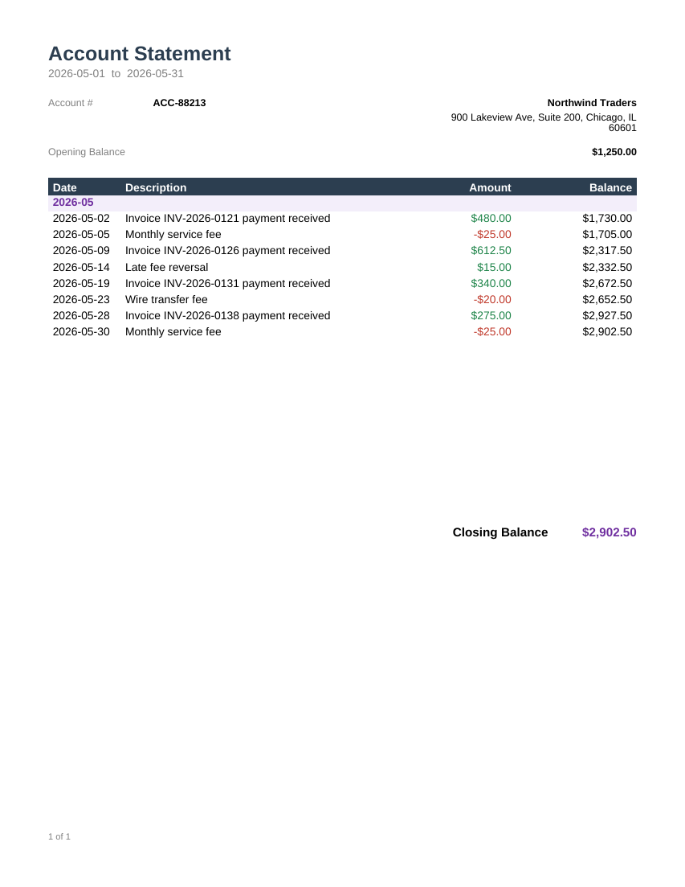

# Account Statement

Transactions grouped by month, with a running balance column and an opening/closing balance
summary.



## Data contract

```json
{
  "AccountNumber": "ACC-88213",
  "AccountHolderName": "...",
  "AccountHolderAddress": "...",
  "StatementPeriodStart": "2026-05-01",
  "StatementPeriodEnd": "2026-05-31",
  "OpeningBalance": 1250.00,
  "Transactions": [
    { "Date": "2026-05-02", "Description": "...", "Amount": 480.00 }
  ]
}
```

`Date` is a plain `YYYY-MM-DD` string -- the report groups transactions by month using
`Left(Fields!Date.Value, 7)`, so multi-month statements get one group header per month
automatically. `Amount` is signed: positive for credits, negative for debits. The running
`Balance` column is `OpeningBalance + RunningValue(Amount, Sum, "Transactions")`.

See [`sample-data.json`](sample-data.json) for a complete example.

## Render it

Same pattern as the [Invoice](../invoice) template -- see its README for the full snippet.
Substitute `account-statement.rdl` and your own data (same shape).
