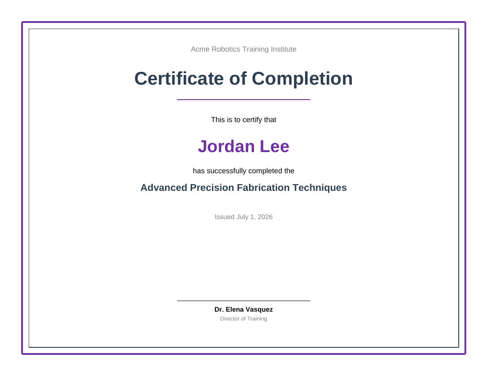

# Certificate

A landscape achievement/completion certificate: a decorative double border (nested `<Rectangle>`
report items), large centered recipient name, and a signature line.



## Data contract

```json
{
  "CertificateTitle": "Certificate of Completion",
  "RecipientName": "Jordan Lee",
  "AchievementText": "has successfully completed the",
  "CourseName": "Advanced Precision Fabrication Techniques",
  "IssueDate": "July 1, 2026",
  "IssuerName": "Acme Robotics Training Institute",
  "SignatoryName": "Dr. Elena Vasquez",
  "SignatoryTitle": "Director of Training"
}
```

See [`sample-data.json`](sample-data.json) for a complete example. This is a single-record
template (no line items) -- render it once per recipient, the same way you would the
[Customer Letter](../customer-letter) template.

## Render it

Same pattern as the [Invoice](../invoice) template -- see its README for the full snippet.
Substitute `certificate.rdl` and your own data (same shape).
