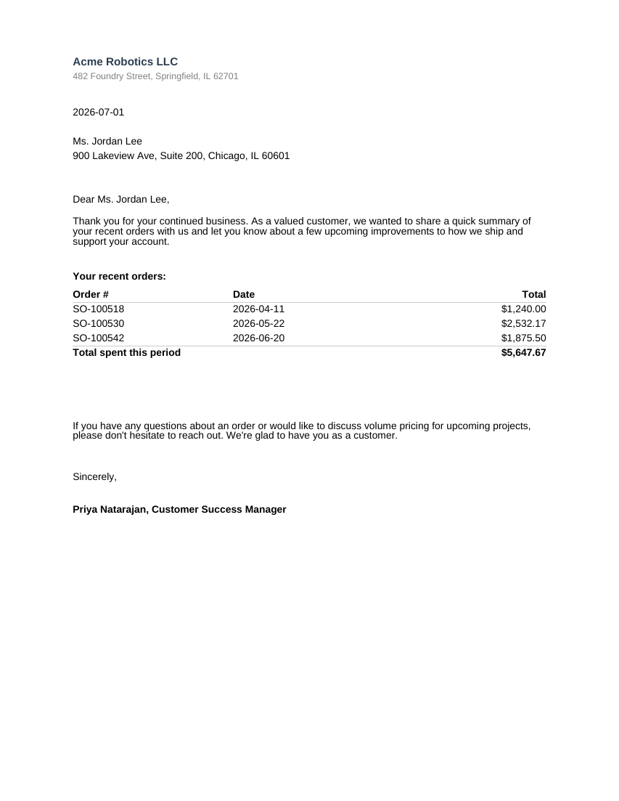

# Customer Letter

A mail-merge style letter: personalized greeting, free-flowing body text, and an embedded
recent-orders table with a computed total -- the kind of one-recipient-per-render letter you'd
loop over a customer list to produce in bulk.



## Data contract

```json
{
  "LetterDate": "2026-07-01",
  "CustomerName": "Ms. Jordan Lee",
  "CustomerAddress": "...",
  "SenderName": "...",
  "SenderAddress": "...",
  "SenderSignatory": "Priya Natarajan, Customer Success Manager",
  "RecentOrders": [
    { "OrderNumber": "SO-100518", "OrderDate": "2026-04-11", "Total": 1240.00 }
  ]
}
```

See [`sample-data.json`](sample-data.json) for a complete example.

## Mail-merge pattern

To send one letter per customer, render this template once per row of a customer list, swapping
in that customer's own JSON (or database row) each time -- the RDL itself doesn't change. Loop
over recipients in your own code and call `RunRender` once per iteration (see "Render it" below).

## Render it

Same pattern as the [Invoice](../invoice) template -- see its README for the full snippet.
Substitute `customer-letter.rdl` and your own data (same shape).
