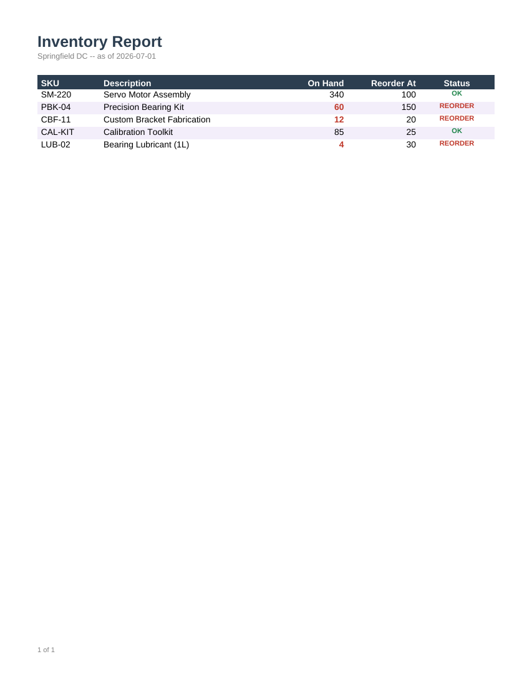

# Inventory Report

Stock levels with conditional formatting: any row where `StockOnHand <= ReorderPoint` is
highlighted in red and flagged "REORDER"; otherwise it shows "OK" in green.



## Data contract

```json
{
  "ReportDate": "2026-07-01",
  "WarehouseName": "Springfield DC",
  "Items": [
    { "Sku": "SM-220", "Description": "...", "StockOnHand": 340, "ReorderPoint": 100 }
  ]
}
```

See [`sample-data.json`](sample-data.json) for a complete example (two items below their reorder
point).

## Render it

Same pattern as the [Invoice](../invoice) template -- see its README for the full snippet.
Substitute `inventory-report.rdl` and your own data (same shape).
