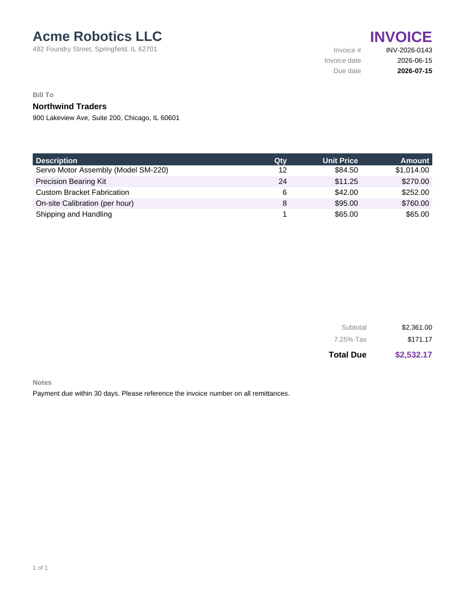

# Invoice

A one-page invoice: company header, bill-to block, a line-item table, and computed subtotal / tax / total.



## Data contract

The template reads a single JSON document via the `Json` data provider (see
[`DataProviders/Json*.cs`](../../DataProviders)). The root object supplies the header fields;
`Lines` is an array of line items.

```json
{
  "InvoiceNumber": "INV-2026-0143",
  "InvoiceDate": "2026-06-15",
  "DueDate": "2026-07-15",
  "CompanyName": "...",
  "CompanyAddress": "...",
  "CustomerName": "...",
  "CustomerAddress": "...",
  "TaxRatePercent": 7.25,
  "Notes": "...",
  "Lines": [
    { "Description": "...", "Quantity": 12, "UnitPrice": 84.50 }
  ]
}
```

See [`sample-data.json`](sample-data.json) for a complete example.

## Render it

```csharp
using Majorsilence.Reporting.Rdl;

RdlEngineConfig.RdlEngineConfigInit();

var rdlXml = (await File.ReadAllTextAsync("invoice.rdl"))
    .Replace("file=sample-data.json", $"file={Path.GetFullPath("sample-data.json")}");

var parser = new RDLParser(rdlXml) { Folder = Directory.GetCurrentDirectory() };
using var report = await parser.Parse();
await report.RunGetData();

var sg = new OneFileStreamGen("invoice.pdf", true);
await report.RunRender(sg, OutputPresentationType.PDF);
```

Swap in your own JSON (same shape) and the template renders as-is -- no RDL changes needed. To
pull the data from a real database instead of a JSON file, change the `<DataSource>`'s
`DataProvider`/`ConnectString` and rewrite the two `<Query>` blocks in `invoice.rdl`; the field
names the report items reference stay the same.
