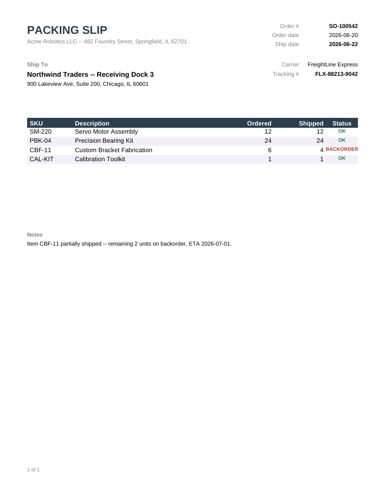

# Packing Slip

Order/ship-to header, carrier and tracking info, and an itemized shipment table that flags
short-shipped lines as "BACKORDER".



## Data contract

```json
{
  "OrderNumber": "SO-100542",
  "OrderDate": "2026-06-20",
  "ShipDate": "2026-06-22",
  "ShippedFrom": "...",
  "ShipToName": "...",
  "ShipToAddress": "...",
  "CarrierName": "...",
  "TrackingNumber": "...",
  "Notes": "...",
  "Items": [
    { "Sku": "SM-220", "Description": "...", "QuantityOrdered": 12, "QuantityShipped": 12 }
  ]
}
```

A line where `QuantityShipped < QuantityOrdered` is highlighted "BACKORDER" in red; otherwise it
shows "OK" in green. See [`sample-data.json`](sample-data.json) for a complete example (one
partially-shipped line included).

## Render it

Same pattern as the [Invoice](../invoice) template -- see its README for the full snippet.
Substitute `packing-slip.rdl` and your own data (same shape).
