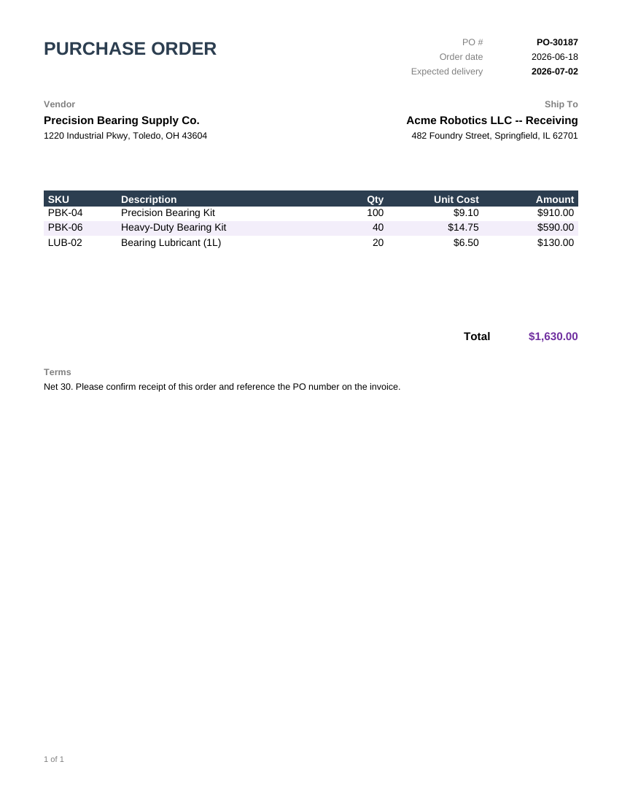

# Purchase Order

A vendor/ship-to header, a line-item table, and a computed total -- the [Invoice](../invoice)
template's structure adapted for outbound procurement instead of billing.



## Data contract

```json
{
  "PONumber": "PO-30187",
  "OrderDate": "2026-06-18",
  "ExpectedDelivery": "2026-07-02",
  "VendorName": "...",
  "VendorAddress": "...",
  "ShipToName": "...",
  "ShipToAddress": "...",
  "Terms": "...",
  "Lines": [
    { "Sku": "PBK-04", "Description": "...", "Quantity": 100, "UnitCost": 9.10 }
  ]
}
```

See [`sample-data.json`](sample-data.json) for a complete example.

## Render it

Same pattern as the [Invoice](../invoice) template -- see its README for the full snippet.
Substitute `purchase-order.rdl` and your own data (same shape).
