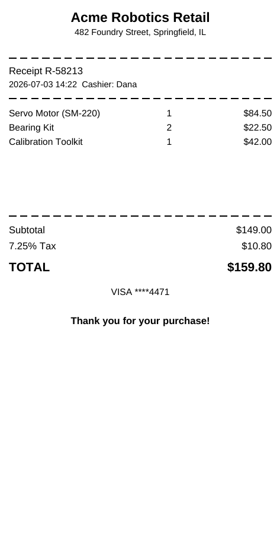

# Receipt (80mm)

A point-of-sale receipt sized for 80mm thermal paper (`<PageWidth>3.15in</PageWidth>`, minimal
margins), with itemized lines and computed subtotal/tax/total.



## Data contract

```json
{
  "StoreName": "Acme Robotics Retail",
  "StoreAddress": "...",
  "ReceiptNumber": "R-58213",
  "ReceiptDate": "2026-07-03 14:22",
  "CashierName": "Dana",
  "TaxRatePercent": 7.25,
  "PaymentMethod": "VISA ****4471",
  "Lines": [
    { "Description": "Servo Motor (SM-220)", "Quantity": 1, "UnitPrice": 84.50 }
  ]
}
```

See [`sample-data.json`](sample-data.json) for a complete example.

## Adjusting for other paper widths

Change `<PageWidth>` (and `<Width>`, and the `<Table>`'s column widths, which should sum to the
new content width) to match your printer -- 58mm registers commonly use `<PageWidth>2.28in</PageWidth>`
with roughly 2.08in of content width after 0.1in margins.

## Render it

Same pattern as the [Invoice](../invoice) template -- see its README for the full snippet.
Substitute `receipt-80mm.rdl` and your own data (same shape).
