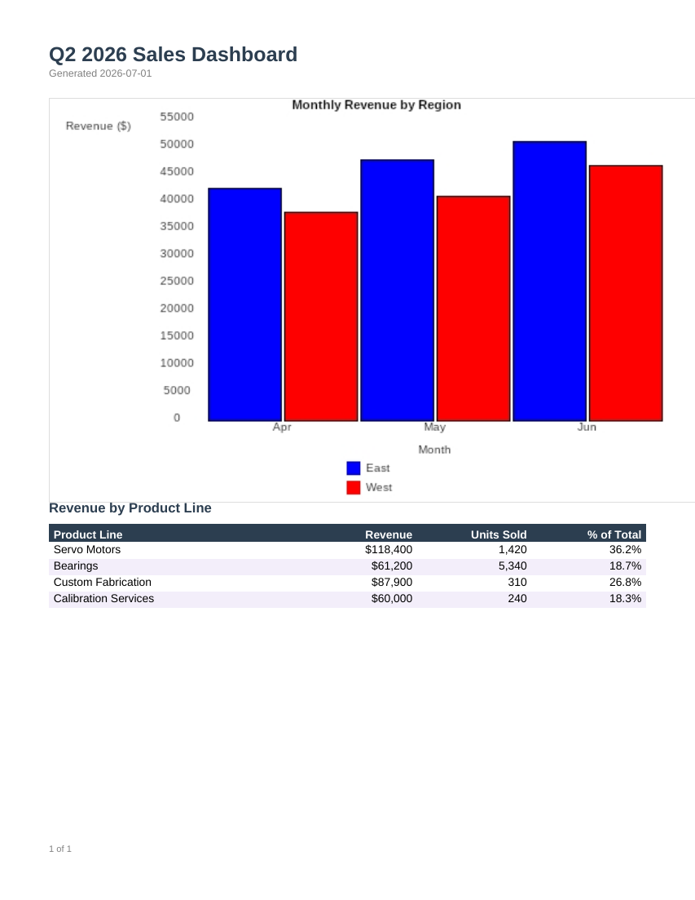

# Sales Dashboard

A monthly revenue-by-region bar chart (the 2005-style RDL `<Chart>` data region -- fully
supported, see [`Chart.cs`](../../RdlEngine/Definition/ChartType.cs) for the subtypes) plus a
product-line summary table with a computed percent-of-total column.



## Data contract

```json
{
  "ReportTitle": "Q2 2026 Sales Dashboard",
  "GeneratedDate": "2026-07-01",
  "MonthlySales": [
    { "Month": "Apr", "MonthOrder": 1, "Region": "East", "Revenue": 42500 }
  ],
  "ProductLines": [
    { "ProductLine": "Servo Motors", "Revenue": 118400, "UnitsSold": 1420 }
  ]
}
```

`MonthlySales` drives the chart: month is the category axis, region is the series grouping,
revenue is summed per (month, region) pair. `ProductLines` drives the table below it.

`MonthOrder` exists because the chart's category grouping sorts by the group key's value (so
plain month abbreviations would come out alphabetically -- Apr, Jun, May -- rather than
chronologically); the chart sorts by `MonthOrder` while still grouping and labeling by `Month`.
If your data already sorts correctly as text (e.g. ISO dates), you can drop this field and the
`<Sorting>` block in `sales-dashboard.rdl`.

## Switching chart type

The chart's `<Type>Column</Type>` element accepts any of the engine's supported chart types --
`Bar`, `Line`, `Pie`, `Scatter`, `Bubble`, `Area`, `Doughnut`, `Stock`, and a couple of
legacy map-style subtypes. Changing `<Type>Column</Type>` to `<Type>Line</Type>` or
`<Type>Pie</Type>` in `sales-dashboard.rdl` is enough to switch styles without touching the
data-binding.

## Render it

Same pattern as the [Invoice](../invoice) template -- see its README for the full snippet.
Substitute `sales-dashboard.rdl` and your own data (same shape).
