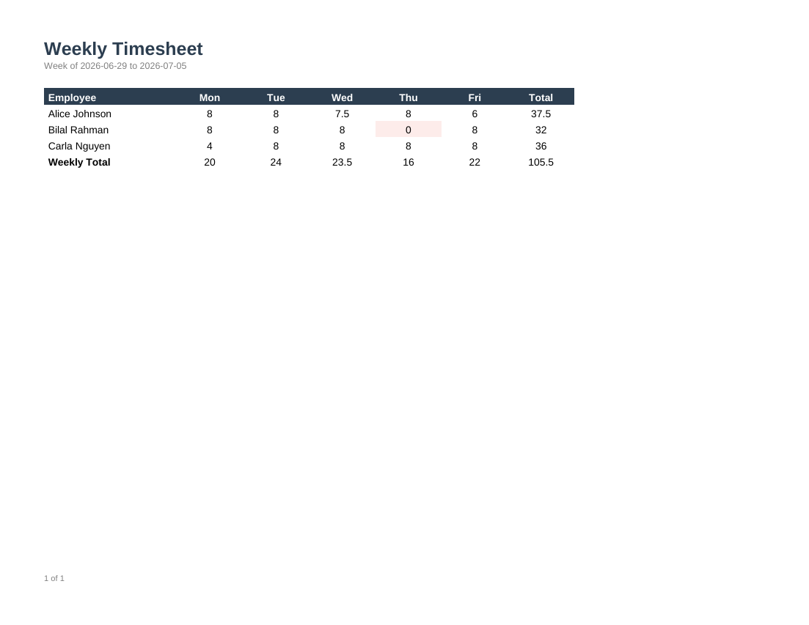

# Timesheet

An Employee x Day matrix using the RDL `<Matrix>` data region (a real crosstab/pivot, distinct
from `<Table>`), with automatic row and column subtotals.



## Data contract

```json
{
  "WeekStarting": "2026-06-29",
  "WeekEnding": "2026-07-05",
  "Entries": [
    { "Employee": "Alice Johnson", "Day": "Mon", "DayOrder": 1, "Hours": 8 }
  ]
}
```

Rows group by `Employee`, columns group by `Day`. As with the [Sales Dashboard](../sales-dashboard)
template's chart, the matrix's column grouping sorts by the group key's value, so `DayOrder`
exists to keep Mon-Fri in calendar order rather than alphabetical (Fri, Mon, Thu, Tue, Wed). Cells
with zero hours are highlighted so a manager can spot missing entries at a glance.

## Render it

Same pattern as the [Invoice](../invoice) template -- see its README for the full snippet.
Substitute `timesheet.rdl` and your own data (same shape).
